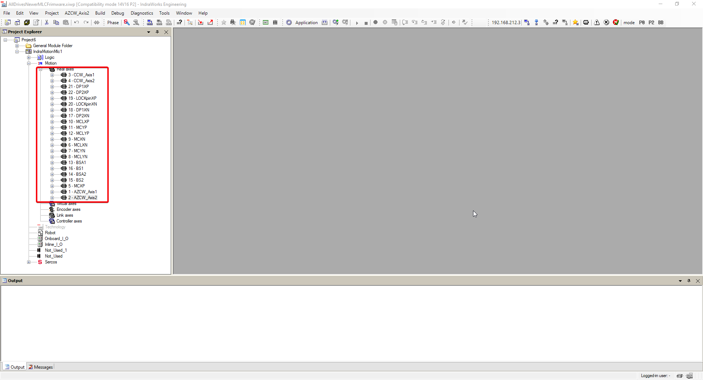
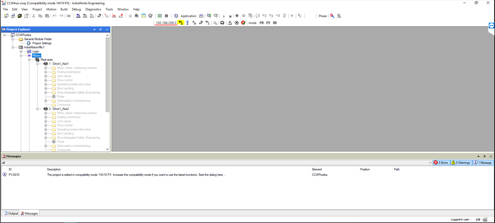
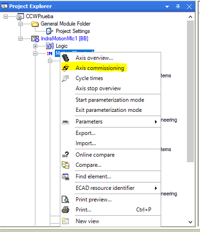
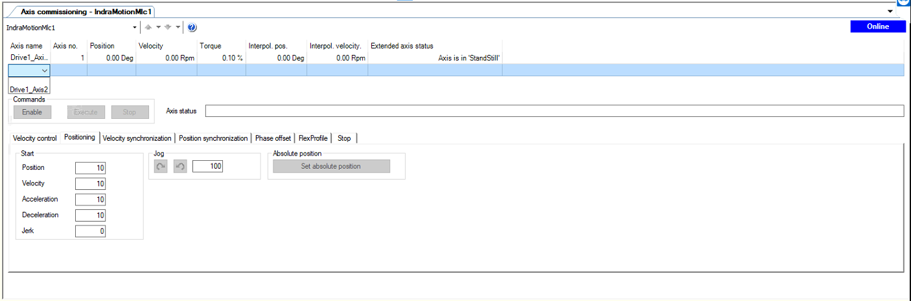
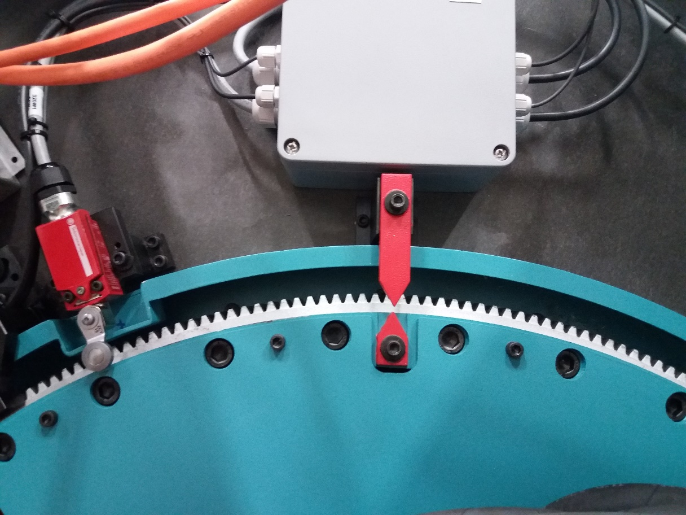
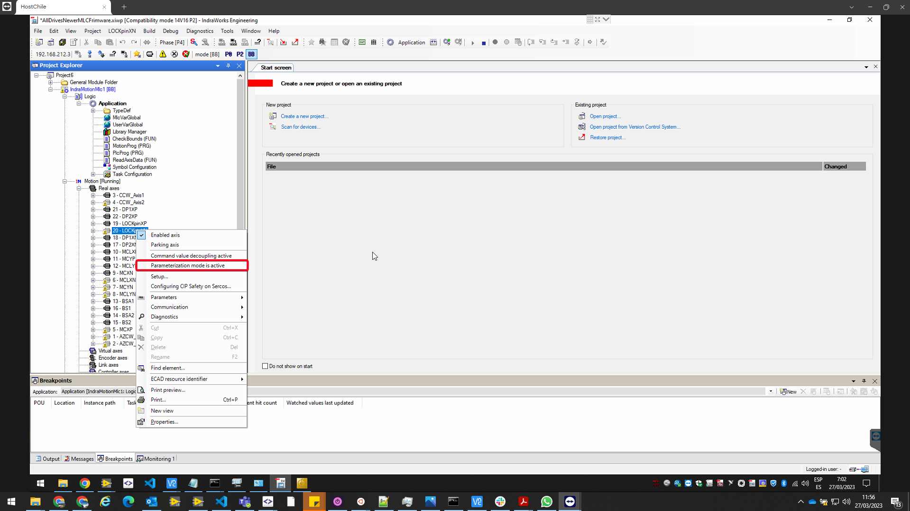
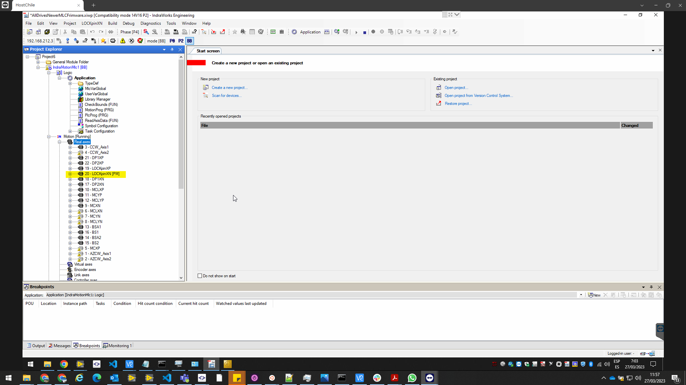
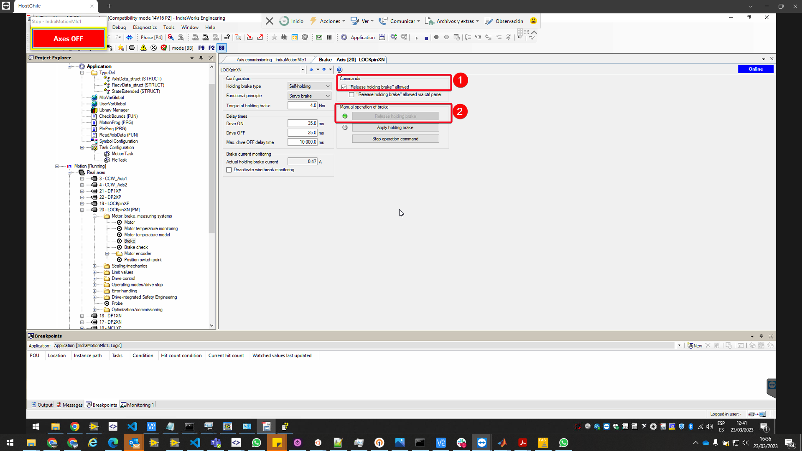
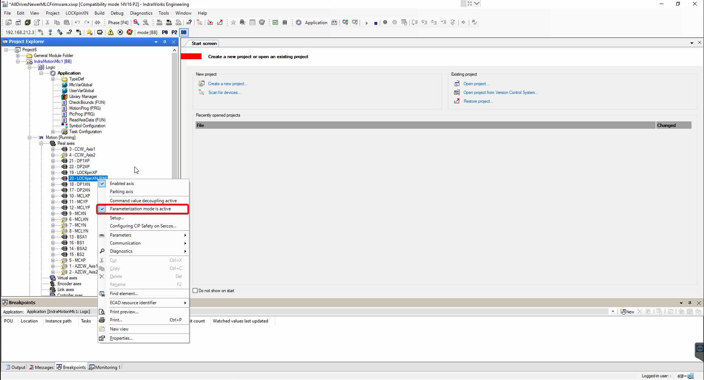

# Replace Bosch Motor

## Introduction

This document describes the procedure to replace a Bosch motor or to perform a maintenance operation out of its place.

Bosch motor are used for:

- Locking pins
- Deployable platforms
- Azimuth Cable Wrap
- Camera Cable Wrap
- Balancing System
- Mirror Cover and Mirror Cover locks

## Reference document list

| **No.** | **DOCUMENT** | **CODE** | **VERSION** |
|---------|--------------|----------|-------------|
| **1**   |MCS Design Electrical Schematics|3151_MCS_0022|9.0|

## Motor replacement procedure

The procedure for replacement the motors have some steps that are common for all subsystems.

After completing the common steps, it could be some checks that are subsystem specific (see point 3.2). As last step, it is recommended to run the test procedure for the subsystem to check the correct operation of the subsystem.

Common steps

1.  Open the Bosch-Rexroth engineering tool IndraWorks Engineering
2.  Open the project with the motion configuration.
    1.  For MCS, AllDrivesNewverMLCFrimware.xiwp
    2.  For CCWAux, CCWAux.xiwp
3.  Find the motor in the Project Explorer under the IndaMotionMlc1-\>Motion-\>Real axes. For CCWAux only the two drives for CCW will be available, but for MCS the complete list shown in the Figure 1, will be available. See Annex 2 for more information about motor names.

    

4.  Note down the number associated with the desired motor
5.  If the movement with the motors is still possible, move the subsystem to the zero-position using the EUI.
    1.  For locking pins use the free position.
    2.  For deployable platforms use the retracted position.
    3.  For Mirror Covers use the retracted position
    4.  For Mirror Cover locks, put the mirror cover in retracted position and lock with mirror cover locks.
    5.  For Balancing motors, move each motor to zero position.
    6.  Azimuth Cable Wrap. Move azimuth to zero absolute position, then move both Azimuth Cable Wrap motors to zero position.
    7.  Camera Cable Wrap. Move camera rotator to zero position, then move both Camera Cable Wrap motors to zero position.
6.  Use the Telescope correct position to ensure that the operation is possible
7.  Power off the EUI computer (MCC), and the electrical cabinets.
8.  Take all necessary security measures that are necessary to lock the system according to health & safety.
9.  Lock the element to avoid movement when motor and brake is released (this is not necessary for Azimuth Cable Wrap and Camera Cable Wrap, since the other motor will keep the subsystem braked).
10.  Take out the motor.
11.  If the movement was not possible in step 5, move the element to zero-position manually (see Annex 1).
12.  Fit the motor to its position and wire according with document **1**.
13. Unlock the element.
14. Open the Bosch-Rexroth engineering tool IndraWorks Engineering. The IndraWorks must be placed in a windows machine with Ethernet connection to the MLC (209A1 element in the schematics MCS_Design_ElectricalSchematics). This document is written for IndraWorks ML\* 14V22 P7.
    1.  For MCS, place the windows machine connected to port Gi1/2 of the Cisco IE3000 switch inside the cabinet using the ip 192.168.209.225 with 255.255.0.0 mask.
    2.  For CCWAux place the windows machine connected to any port of the Cisco IE3000 switch inside the cabinet with the ip 192.168.209.225 with 255.255.255.0 mask.
    3.  If a and b does not work use direct connection to the MLC.
15. Open the project with the motion configuration.
    1.  For MCS, AllDrivesNewverMLCFrimware.xiwp
    2.  For CCWAux, CCWAux.xiwp
16. Connect to MLC. Selecting something in the IndraMotionMlc project tree, the “Switches Device Online” icon is available, or in the Menu “IndraMotionMlc1-\>Switch Online”

    

17.  Enable the axis commissioning in the Motion field under the IndraMotionMlc target. Right click on the Motion.

    

18. Add desired axis to the view opened in the right window. See Annex 2 for more info about motor names.

    

19. Select the axis and in Positioning tab click on “Set absolute position”.
20. Disconnect the IndraWorks clicking in the “Switch Devices Offline” icon or in the Menu “IndarMotionMlc1-\>Switch Offline”.
    1.  When asked, save the parameters in drives.

## Subsystem specific checks

###  Camera cable wrap

There are two checks to perform with camera cable wrap.

####  Same reading in both motors

Using the EUI and if the CCW is not linked to the camera, switch on the CCW and move to -45 degrees with motor 1 and check that the motors readings are inside 0.3 degrees. Change to motor 2 and move to 45 degrees and check that both motors readings are inside 0.3 degrees (See test CE_CCW_4a and CE_CCW_4b from 3151_MCS_044a test procedure for more info about managing active drive).

If the CCW is linked to the camera do the same test but moving only 1.5 degress in each direction. If one of the limits is pressed in the 1.5 degress movement means that CCW is not in the middle of the rotator gap, so try to move to positions close to the limits at 0.2 deg/s in both directions. In the extreme positions check that both motors readings are inside 0.3 degrees.

####  Travel limits in 92 degrees

If the CCW is not linked to the camera proceed with test CE_CCW_5k from 3151_MCS_044a test procedure and check that the limits are located at ±92 ±0.3 degrees.

If the CCW is linked to the camera move the camera to allow moving the CCW to the limits.

#  Annex 1. Manual movement procedure

This section will cover how to proceed when the motor is not able to move the subsystem to the zero position. In that case the procedure described in section 3.1 includes the point 9 to move manually to a fixed position. In the different points of this section this position is defined as well as some other steps to add to the basic procedure to get the subsystem running properly

## Camera Cable Wrap

In the camera cable wrap there are two red arrows, one in the rotating part and other in the fixed part. When those arrows are aligned, the position of the camera cable wrap is 0 degrees.

If the specific check 3.2.1.2 fails, it could be because the arrows are not aligned good enough. The camera cable wrap could be move to zero position plus-minus the error detected in both limits and proceed with step 13 of the section 3.1 again.

## Azimuth Cable Wrap

The steps to find the zero of the azimuth cable wrap, when none of the motors is able to move the azimuth cable wrap, are describe in next points.

1.  Proceed with the procedure specified in section 3.1 up to point 13 inclusive
2.  In the project view of Indraworks Engineering, select one the motors for Azimuth Cable Wrap and open the XXX window
3.  In XXX box put actual Azimuth Absolute Position +360 deg (this value must not be very accurate). For instance, if the actual Azimuth position is 123 deg put 483 deg in XXX box.
4.  Press the button XXX to set this position as actual motor position.
5.  Check that Azimuth cable is close to the center of the physical limits between azimuth and azimuth cable wrap limits.
6.  If the motor is not in the center of the physical limits, enable the motor using and move the azimuth cable wrap to position in the centre of the limits. To enable the motor and move proceed with next steps
    1.  Proceed with the steps 15 to 16 of section 3.1.
    2.  Go to the Positioning tab and insert 0.1 in the Velocity box.
    3.  Enable the motor
    4.  In Positioning tab use the position box to put the desired new position to correct the gap between the actual position and the center of the limits, and click Execute. This step could be executed several times.
7.  Disable the motor
8.  Replace the second motor and proceed in the same way as for the first one
9.  In the XXX box of step 3 put 360 deg
10. Close Axis Commissioning.
11. Power on Azimuth
12. Home Azimuth
13. Move to zero position
14. Continue with step 14 on of section 3.1

## Locking pins

Move the locking pins manually to unlocked position, just when the most external switch is free.

Note: Do not release both locking pins at the same time.

## Deployable Platforms

Move the platforms to the retracted position where the platform is hitting with the mechanical limit. This is the zero for the platforms.

## Balancing

## Mirror Cover

Move the desired mirror cover to retracted position once the motor is released from the mirror cover.

## Mirror Cover locks

Remove the motor and move manually to lock position. The mirror cover lock must be able to lock the mirror cover without hitting in any mirror cover.

# Annex2. Release the motor brake

**To manage the motor brake from the Indarworks the motor could no be used by the EUI**. The EUI will fault using this motor.

If the motor has a brake it could be released using the Indraworks engineering tool. To enable the capability of managing the Brake from the Indraworks the drive must be in Parametrization mode. To put the drive in Parametrization mode right click in the drive and select the parametrization mode.

If the drive is parametrization mode, [PM] is shown next to the drive

To manage the brake, open the drive, then the Motor, brake, measuring systems folder, and there the Brake page. Make sure that in commands section the "Release holding brake" allowed is enabled and then pressing Release holding brake or Apply holding brake, the brake will release or engage.

<mark>It is mandatory to disable parametrization mode in the drive.</mark> Once the operation is finished the parametrization mode in the drive must be disabled. Right click in the drive and click on Parametrization mode to disable it. 

# Annex 3. Motor names in Indraworks

This annex describes the names used for the motors in the IndraWorks tool

## Locking Pins

LOCKpinXP. Locking pin located in the axis x+ of the telescope coordinate axes.

LOCKpinXN. Locking pin located in the axis x- of the telescope coordinate axes.

## Deployable Platforms

DP1XP. Motor of the section 1 of the deployable platform located in the axis x+ of the telescope coordinate axes.

DP2XP. Motor of the section 2 of the deployable platform located in the axis x+ of the telescope coordinate axes.

DP1XN. Motor of the section 1 of the deployable platform located in the axis x- of the telescope coordinate axes.

DP2XN. Motor of the section 2 of the deployable platform located in the axis x- of the telescope coordinate axes.

## Mirror Cover

MCLXP. Motor for the mirror cover lock for the mirror cover located in the axis x+ of the telescope coordinate axes.

MCXP. Motor for the mirror cover located in the axis x+ of the telescope coordinate axes.

MCLYP. Motor for the mirror cover lock for the mirror cover located in the axis y+ of the telescope coordinate axes.

MCYP. Motor for the mirror cover located in the axis y+ of the telescope coordinate axes.

MCLXN. Motor for the mirror cover lock for the mirror cover located in the axis x- of the telescope coordinate axes.

MCXN. Motor for the mirror cover located in the axis x- of the telescope coordinate axes.

MCLYN. Motor for the mirror cover lock for the mirror cover located in the axis y- of the telescope coordinate axes.

MCYN. Motor for the mirror cover located in the axis y- of the telescope coordinate axes.

## Balancing system

BAL_0XPos. Motor that moves the balancing mass located in x+ of the telescope coordinate axes and has effect when elevation axis of the telescope is at 0 degrees.

BAL_90XPos. Motor that moves the balancing mass located in x+ of the telescope coordinate axes and has effect when elevation axis of the telescope is at 90 degrees.

BAL_0XNeg. Motor that moves the balancing mass located in x- of the telescope coordinate axes and has effect when elevation axis of the telescope is at 0 degrees.

BAL_90XNeg. Motor that moves the balancing mass located in x- of the telescope coordinate axes and has effect when elevation axis of the telescope is at 90 degrees.

## Azimuth Cable Wrap

The AZCW_Axis1. The motor connected to channel one of the 105U3 HMD01 Bosch Rexroth driver

The AZCW_Axis2. The motor connected to channel two of the 105U3 HMD01 Bosch Rexroth driver

## Camera Cable Wrap

The CCW_Axis1. The motor connected to channel one of the 105U4 HMD01 Bosch Rexroth driver (105U2 for CCWAux cabinet).

The CCW_Axis2. The motor connected to channel two of the 105U4 HMD01 Bosch Rexroth driver (105U2 for CCWAux cabinet).

